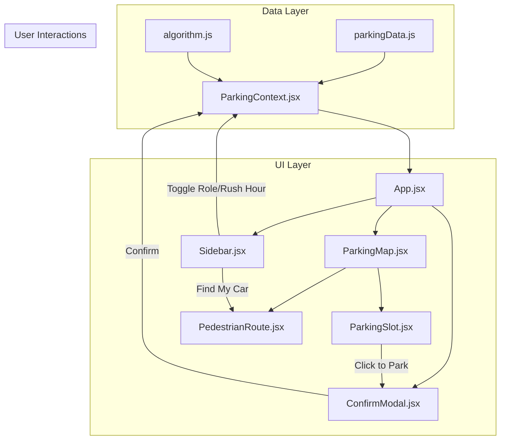

# Smart Parking System — MVP Implementation Plan

Membangun aplikasi SaaS "Smart Parking System" berbasis web dengan visualisasi isometric 2.5D, weighted scoring algorithm, dan fitur simulasi parkir interaktif.

---

## Tech Stack

| Layer | Choice | Rationale |
|-------|--------|-----------|
| **Framework** | Vite + React 19 | Lightweight, fast HMR, cocok untuk MVP |
| **Styling** | Tailwind CSS v4 | Sesuai permintaan user |
| **Icons** | Lucide React | Lightweight, tree-shakeable |
| **Animation** | CSS Keyframes + Tailwind | Cukup untuk pulse, glow, transitions |
| **State** | `useReducer` + Context | Cocok untuk multiple interrelated states |

---

## User Review Required

> [!IMPORTANT]
> **Tailwind CSS Version**: Spec meminta Tailwind CSS. Saya akan menggunakan **Tailwind CSS v4** (latest via `@tailwindcss/vite`). Jika Anda prefer v3, beri tahu.

> [!IMPORTANT]
> **Single File vs Multi-Component**: Spec menyebutkan "satu file panjang jika memungkinkan". Saya akan **memecah menjadi komponen logis** (Sidebar, Map, Modal, dll.) agar maintainable, tapi tetap menyertakan semua kode. Ini lebih baik untuk production readiness. Setuju?

> [!IMPORTANT]
> **Hardware Integration**: Spec ini membuat MVP dengan simulated data (`isOccupied` di-generate random). Nanti untuk integrasi hardware, Anda tinggal mengganti data source (e.g., WebSocket/API polling) tanpa mengubah UI. Apakah Anda ingin saya sudah menyiapkan placeholder untuk WebSocket/API, atau murni simulasi dulu?

---

## Open Questions

> [!NOTE]
> **Responsiveness**: Spec menyebutkan "responsif minimal untuk Tablet/Desktop". Apakah ada kebutuhan mobile view juga, atau murni dashboard yang diakses dari layar besar saja?

> [!NOTE]
> **Branding**: Apakah ada nama spesifik untuk aplikasi ini (misalnya "ParkSmart", "SpotIQ", dll.), atau gunakan "Smart Parking System" saja?

---

## Proposed Changes

### Project Scaffolding

#### [NEW] Vite + React Project

Inisialisasi project menggunakan:
```bash
npx -y create-vite@latest ./ --template react
npm install lucide-react
npm install -D @tailwindcss/vite tailwindcss
```

Konfigurasi Tailwind v4 via Vite plugin di `vite.config.js`.

---

### Data Layer

#### [NEW] [parkingData.js](file:///home/abiyulinx/computing/parking_prd/src/data/parkingData.js)

Berisi:
- **`generateParkingLots()`**: Factory function yang menghasilkan 24 lot parkir
  - 12 lot di Lantai 1 (ID: `L1-A1` s/d `L1-A6`, `L1-B1` s/d `L1-B6`) — grid 2 rows × 6 cols
  - 12 lot di Lantai 2 (ID: `L2-A1` s/d `L2-A6`, `L2-B1` s/d `L2-B6`) — grid 2 rows × 6 cols
  - `jarakLobby`: Dihitung berdasarkan posisi grid (row 0, col 0 = 5m, incrementally ke 50m)
  - `kepadatanPrediksi`: Random 1–10
  - `isOccupied`: ~60% set `true` secara random
  - `isVIP`: Default `false`

#### [NEW] [ParkingContext.jsx](file:///home/abiyulinx/computing/parking_prd/src/context/ParkingContext.jsx)

Global state management menggunakan `useReducer` + React Context:

```
State Shape:
{
  parkingLots: ParkingLot[],
  userRole: "reguler" | "vip",
  isRushHour: boolean,
  parkedCarId: string | null,
  viewMode: "map" | "pedestrian_route",
  selectedFloor: 1 | 2,
  recommendations: ParkingLot[]
}
```

Actions/Reducer:
- `SET_USER_ROLE` — toggle reguler/vip
- `TOGGLE_RUSH_HOUR` — activate/deactivate VIP allocation
- `PARK_CAR` — set lot occupied + store parkedCarId
- `LEAVE_PARKING` — reset parkedCarId + free lot
- `SET_VIEW_MODE` — toggle map/pedestrian_route
- `SET_FLOOR` — switch floor view
- `RECALCULATE_RECOMMENDATIONS` — trigger algorithm

---

### Core Algorithm

#### [NEW] [algorithm.js](file:///home/abiyulinx/computing/parking_prd/src/utils/algorithm.js)

**`getRecommendations(parkingLots, userRole)`** — Weighted Scoring Algorithm:

```
// ============================================
// WEIGHTED SCORING ALGORITHM
// Ubah bobot (w1, w2, w3) di sini untuk tuning
// ============================================
// C = (w1 * jarakLobby) + (w2 * penaltiLantai) + (w3 * kepadatanPrediksi)
//
// w1 = 0.5  → Bobot jarak jalan kaki
// w2 = 15   → Penalti naik ke Lantai 2
// w3 = 2    → Bobot menghindari keramaian
```

Flow:
1. Filter `isOccupied === false`
2. Jika `userRole === "reguler"`, buang `isVIP === true`
3. Hitung nilai C untuk setiap lot
4. Sort ascending by C
5. Slice top 3
6. Return recommendations array

**`allocateVIPLots(parkingLots)`** — Rush Hour VIP Allocation:
1. Filter `isOccupied === false`
2. Sort by `jarakLobby` ascending
3. Ambil 5 teratas, set `isVIP = true`

---

### UI Components

#### [NEW] [App.jsx](file:///home/abiyulinx/computing/parking_prd/src/App.jsx)

Root component:
- Wraps everything in `ParkingProvider`
- Split-screen layout: Sidebar (30%) | Map (70%)
- Dark elegant background (`#0a0e1a` → `#111827`)

---

#### [NEW] [Sidebar.jsx](file:///home/abiyulinx/computing/parking_prd/src/components/Sidebar.jsx)

Panel kontrol & informasi (30% width):

Sections:
1. **Header**: Logo + "Smart Parking System" title
2. **Stats Bar**: Total lots, available, occupied (with percentage ring/bar)
3. **Controls**:
   - User Role toggle (Reguler ↔ VIP) — styled toggle switch
   - Rush Hour toggle — styled toggle switch with warning indicator
   - Floor selector (Lantai 1 / Lantai 2) — tab buttons
4. **Recommendations Panel**: 
   - Card list of top 3 recommended lots
   - Each card shows: Lot ID, jarak, lantai, cost score
   - Click → highlight lot on map
5. **Parked Mode** (when `parkedCarId !== null`):
   - Shows parked lot info
   - "Cari Mobil Saya" button (large, cyan neon glow)
   - "Keluar Parkir" button

---

#### [NEW] [ParkingMap.jsx](file:///home/abiyulinx/computing/parking_prd/src/components/ParkingMap.jsx)

Visualisasi isometric 2.5D (70% width):

- **Isometric Container**:
  ```css
  transform: rotateX(60deg) rotateZ(-45deg);
  transform-style: preserve-3d;
  ```
- **CSS Grid**: 2 rows × 6 cols per lantai
- **Floor Rendering**: Render lantai yang aktif (berdasarkan `selectedFloor`)
  - Lantai base plate (dark surface with grid lines)
  - Lot slots rendered on top
- **Lot Rendering**: Setiap lot adalah div 3D dengan:
  - `translateZ` untuk efek ketinggian
  - Color coding sesuai status (red/green/amber/pulse-white)
  - Tooltip on hover: ID, jarak, status
  - Click handler untuk parkir

---

#### [NEW] [ParkingSlot.jsx](file:///home/abiyulinx/computing/parking_prd/src/components/ParkingSlot.jsx)

Individual lot component:

Visual States:
| State | Background | Border | Extra |
|-------|-----------|--------|-------|
| Occupied | `rgba(239,68,68,0.4)` | `rgb(239,68,68)` | Car icon |
| Available | `rgba(52,211,153,0.6)` | `rgb(110,231,183)` | — |
| VIP (available) | `rgba(251,191,36,0.6)` | `rgb(252,211,77)` | Crown icon |
| Recommended | Green + pulse animation | White glow `box-shadow` | Rank label (1,2,3) |

---

#### [NEW] [PedestrianRoute.jsx](file:///home/abiyulinx/computing/parking_prd/src/components/PedestrianRoute.jsx)

SVG overlay pada map:
- Draws a neon cyan line dari Lobby (pojok grid) ke `parkedCarId` lot position
- Animated dashed line effect (CSS `stroke-dashoffset` animation)
- Lobby marker icon di titik awal
- Car marker icon di titik akhir

---

#### [NEW] [ConfirmModal.jsx](file:///home/abiyulinx/computing/parking_prd/src/components/ConfirmModal.jsx)

Liquid Glass Modal:
- Backdrop blur (`backdrop-filter: blur(20px)`)
- Glassmorphism card: semi-transparent white/dark with border
- Content: "Konfirmasi Parkir di Lot [ID]?"
- Buttons: "Ya, Parkir" (green) + "Batal" (ghost)
- Smooth scale+fade entrance animation

---

### Styling

#### [NEW] [index.css](file:///home/abiyulinx/computing/parking_prd/src/index.css)

- Tailwind v4 `@import "tailwindcss"` directive
- Custom CSS `@keyframes`:
  - `pulse-recommend`: Strong pulse with white glow for recommended lots
  - `dash-animate`: Moving dashed line for pedestrian route
  - `float-up`: Subtle floating animation for floor layers
- Custom CSS variables for the dark theme palette
- Google Fonts import: **Inter** (body) + **JetBrains Mono** (data/numbers)

---

## Architecture Diagram



---

## Verification Plan

### Automated Tests

```bash
# 1. Project builds without errors
npm run build

# 2. Dev server runs correctly
npm run dev
```

### Browser Testing

Saya akan melakukan browser testing untuk memverifikasi:

1. **Visual**: Isometric map renders correctly dengan color coding yang benar
2. **Algorithm**: Recommendations berubah saat toggle Rush Hour / User Role
3. **Interaction Flow**:
   - Klik lot kosong → modal muncul → konfirmasi → lot berubah merah
   - Sidebar berubah ke "Parked Mode"
   - Klik "Cari Mobil" → pedestrian route muncul
4. **Rush Hour**: Toggle ON → 5 lot terdekat jadi VIP (kuning) → rekomendasi reguler berubah
5. **Responsiveness**: Layout tidak pecah di tablet/desktop viewport

### Manual Verification

- User diminta untuk mencoba flow lengkap di browser dan memberikan feedback visual
